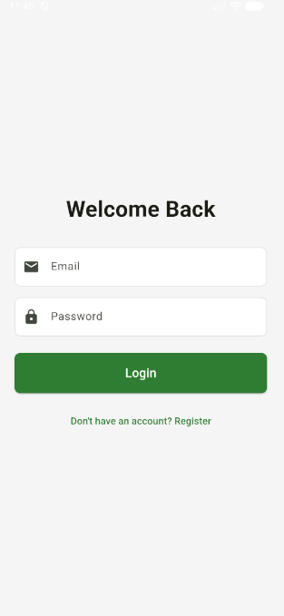
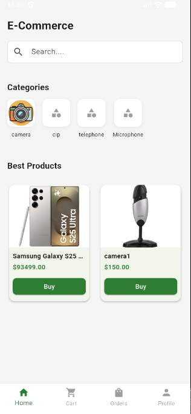
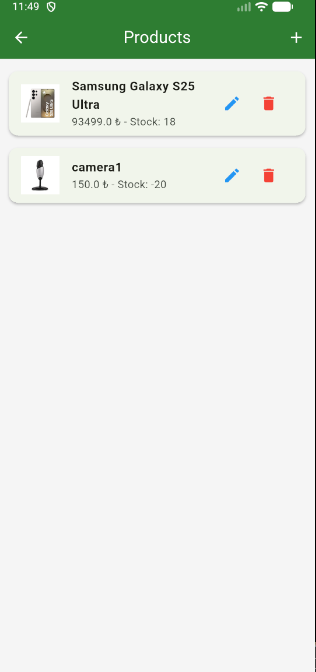
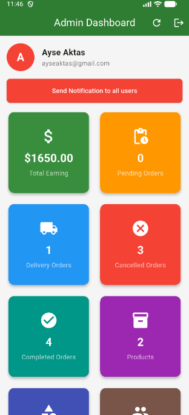
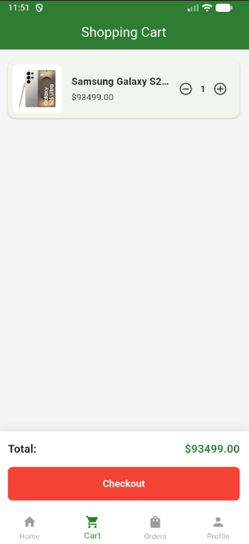
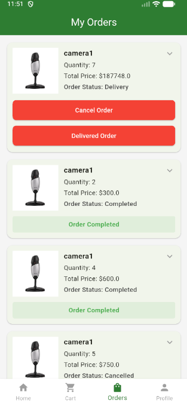

# Flutter Admin Panel & E-Commerce App

<div align="right">
  <a href="#türkçe-readme">Türkçe Oku</a> | <a href="#english-readme">Read in English</a>
</div>

---

<a id="english-readme"></a>

# English README

## Project Overview

**Flutter Admin Panel & E-Commerce App** is a comprehensive solution designed to manage an online store completely from mobile devices. It features two distinct but integrated interfaces:
1.  **User App**: For customers to browse products, manage their cart, place orders, and track their purchase history.
2.  **Admin Panel**: For store owners to manage products, categories, users, and orders in real-time.

This project demonstrates a full-stack implementation using **Flutter** for the frontend and **Firebase** (Auth, Firestore) with **Cloudinary** for the backend services.

### Key Features

#### User App
-   **Authentication**: Secure login and registration using Firebase Auth.
-   **Product Browsing**: View products by category, search functionality, and detailed product views.
-   **Shopping Cart**: Add items, adjust quantities, and manage cart contents.
-   **Order Management**: Place orders and track their status (Pending, Shipping, Delivered, etc.).
-   **Profile Management**: Update user details and view order history.

#### Admin Panel
-   **Dashboard**: View real-time statistics (Total Orders, revenue, active users).
-   **Product Management**: Add, edit, and delete products. Upload images directly to Cloudinary.
-   **Order Management**: View all customer orders, update order status (e.g., mark as "Shipped"), and filter data.
-   **User Management**: View registered users and manage their access.
-   **Notifications**: (Planned) Send push notifications to users.

### Tech Stack
-   **Frontend**: [Flutter](https://flutter.dev/) (Dart)
-   **State Management**: [Provider](https://pub.dev/packages/provider)
-   **Backend**: [Firebase](https://firebase.google.com/) (Firestore Database, Authentication)
-   **Storage**: [Cloudinary](https://cloudinary.com/) (Image hosting)
-   **Architecture**: MVVM / Service-Repository Pattern

---

## E-Commerce App

| | |
|:---:|:---:|
|  |  |
|  |  |
|  |  |

---

## Installation & Setup (Android Studio)

Follow these steps to set up and run the project locally using **Android Studio**.

### Prerequisites
-   [Android Studio](https://developer.android.com/studio) installed.
-   [Flutter SDK](https://docs.flutter.dev/get-started/install) installed and configured.
-   Flutter plugin installed in Android Studio (**Settings** > **Plugins** > Search "Flutter").

### Step 1: Clone the Repository
Open your terminal or Git Bash and run:
```bash
git clone https://github.com/ayse-aktas/flutter_admin_panel_development.git
```
Then, open **Android Studio**, select **Open**, and navigate to the cloned folder.

### Step 2: Install Dependencies
Open the **Terminal** tab in Android Studio (usually at the bottom) and run:
```bash
flutter pub get
```
This downloads all necessary packages listed in `pubspec.yaml`.

### Step 3: Firebase Configuration
1.  Go to [Firebase Console](https://console.firebase.google.com/) and create a new project.
2.  Add an **Android App** with package name: `com.csayse.flutter_admin_panel_development`.
3.  Download the `google-services.json` file.
4.  Place this file in your project at:
    `android/app/google-services.json`
5.  Enable **Authentication** (Email/Password) and **Firestore Database** in Firebase Console.

### Step 4: Cloudinary Configuration
This app uses Cloudinary for image optimization and storage.
1.  Sign up at [Cloudinary](https://cloudinary.com/).
2.  Go to **Settings** > **Upload** and add a new **Unsigned Upload Preset**.
3.  Create a file named `.env` in the root directory of the project.
4.  Add your Cloudinary keys to the `.env` file like this:
    ```env
    CLOUDINARY_CLOUD_NAME=your_cloud_name
    CLOUDINARY_UPLOAD_PRESET=your_unsigned_preset
    ```

### Step 5: Run the App
1.  In Android Studio, locate the **Device Manager** icon in the toolbar.
2.  Create or select an Android Virtual Device (AVD) and start it.
3.  Make sure `main.dart` is selected in the Run configuration dropdown.
4.  Click the version green **Play (Run)** button or press `Shift + F10`.

---

## Architecture

The project follows a clean architecture principle to separate UI, Logic, and Data.

-   **Models**: Data structures (e.g., `Product`, `Order`, `UserModel`).
-   **Services**: Handle API calls and database interactions (e.g., `AuthService`, `DatabaseService`, `StorageService`).
-   **Providers**: Manage state and business logic, notifying the UI of changes.
-   **Screens**: UI components, further divided into `admin` and `user` folders.

### Challenges & Solutions
-   **Dual Role Management**: Implemented a role-based check in `AuthService` to direct users to the correct dashboard (Admin vs User) upon login.
-   **Image Uploads**: Used Cloudinary's unsigned preset to allow direct mobile uploads without complex backend signatures, reducing server load.

---

<br><br><br>

<a id="türkçe-readme"></a>

# Türkçe README

## Proje Hakkında

**Flutter Admin Panel & E-Ticaret Uygulaması**, bir online mağazayı tamamen mobil cihazlar üzerinden yönetmek için tasarlanmış kapsamlı bir çözümdür. Proje, birbiriyle entegre çalışan iki ana arayüzden oluşur:
1.  **Kullanıcı Uygulaması**: Müşterilerin ürünleri incelemesi, sepete eklemesi, sipariş vermesi ve sipariş geçmişini takip etmesi içindir.
2.  **Admin Paneli**: Mağaza sahiplerinin ürünleri, kategorileri, kullanıcıları ve siparişleri gerçek zamanlı olarak yönetmesi içindir.

Bu proje, frontend tarafında **Flutter**, backend servisleri için ise **Firebase** (Auth, Firestore) ve **Cloudinary** kullanılarak geliştirilmiştir.

### Temel Özellikler

#### Kullanıcı Tarafı
-   **Kimlik Doğrulama**: Firebase Auth ile güvenli kayıt ve giriş.
-   **Ürün İnceleme**: Kategorilere göre filtreleme, arama ve detaylı ürün görüntüleme.
-   **Alışveriş Sepeti**: Ürün ekleme, adet güncelleme ve sepet yönetimi.
-   **Sipariş Takibi**: Sipariş oluşturma ve durum takibi (Hazırlanıyor, Kargoda, Teslim Edildi vb.).
-   **Profil**: Kullanıcı bilgilerini güncelleme ve geçmiş siparişleri görüntüleme.

#### Admin Paneli
-   **Panel (Dashboard)**: Gerçek zamanlı istatistikler (Toplam sipariş, gelir, aktif kullanıcılar).
-   **Ürün Yönetimi**: Ürün ekleme, düzenleme, silme ve Cloudinary'ye görsel yükleme.
-   **Sipariş Yönetimi**: Müşteri siparişlerini görüntüleme ve durum güncelleme.
-   **Kullanıcı Yönetimi**: Kayıtlı kullanıcıları görüntüleme.

### Teknolojiler
-   **Arayüz**: [Flutter](https://flutter.dev/) (Dart)
-   **Durum Yönetimi**: [Provider](https://pub.dev/packages/provider)
-   **Backend**: [Firebase](https://firebase.google.com/) (Firestore Veritabanı, Auth)
-   **Depolama**: [Cloudinary](https://cloudinary.com/) (Resim barındırma)
-   **Mimari**: MVVM / Servis-Repo Deseni

---

## E-Commerce App

| | |
|:---:|:---:|
|  |  |
|  |  |
|  |  |

---

## Kurulum ve Çalıştırma (Android Studio)

Projeyi yerel ortamınızda **Android Studio** kullanarak çalıştırmak için aşağıdaki adımları takip edin.

### Gereksinimler
-   Bilgisayarınızda [Android Studio](https://developer.android.com/studio) kurulu olmalıdır.
-   [Flutter SDK](https://docs.flutter.dev/get-started/install) kurulu ve tanımlanmış olmalıdır.
-   Android Studio içinde **Flutter** eklentisi yüklü olmalıdır.

### Adım 1: Projeyi Klonlayın
Terminal veya Git Bash ekranını açın ve şu komutu girin:
```bash
git clone https://github.com/ayse-aktas/flutter_admin_panel_development.git
```
Ardından Android Studio'yu açın, **Open** diyerek indirdiğiniz klasörü seçin.

### Adım 2: Kütüphaneleri Yükleyin
Android Studio'nun alt kısmındaki **Terminal** sekmesine tıklayın ve şu komutu çalıştırın:
```bash
flutter pub get
```
Bu komut, `pubspec.yaml` içindeki tüm bağımlılıkları indirecektir.

### Adım 3: Firebase Ayarları
1.  [Firebase Console](https://console.firebase.google.com/) adresine gidin ve yeni proje oluşturun.
2.  Bir **Android Uygulaması** ekleyin ve paket ismini `com.csayse.flutter_admin_panel_development` olarak girin.
3.  Size verilen `google-services.json` dosyasını indirin.
4.  Bu dosyayı projenizin şurasına yapıştırın:
    `android/app/google-services.json`
5.  Firebase Console üzerinden **Authentication** (Email/Password) ve **Firestore Database** servislerini aktifleştirin.

### Adım 4: Cloudinary Ayarları
Uygulama resim yüklemeleri için Cloudinary kullanır.
1.  [Cloudinary](https://cloudinary.com/) hesabınıza giriş yapın.
2.  **Settings** > **Upload** kısmından yeni bir **Unsigned Upload Preset** oluşturun.
3.  Projenin ana dizininde `.env` isminde bir dosya oluşturun.
4.  Aşağıdaki gibi Cloudinary bilgilerinizi bu dosyaya ekleyin:
    ```env
    CLOUDINARY_CLOUD_NAME=cloud_isminiz
    CLOUDINARY_UPLOAD_PRESET=unsigned_preset_isminiz
    ```

### Adım 5: Uygulamayı Başlatın
1.  Android Studio araç çubuğunda **Device Manager** simgesine tıklayın.
2.  Bir Sanal Cihaz (Emulator) seçin ve başlatın.
3.  Üst kısımdaki çalıştırma menüsünde `main.dart` dosyasının seçili olduğundan emin olun.
4.  Yeşil **Oynat (Run)** tuşuna basın veya `Shift + F10` kısayolunu kullanın.

---

## Mimari Yapı

Proje, arayüz, iş mantığı ve veriyi birbirinden ayıran temiz bir mimari yapıyı takip eder.

-   **Models**: Veri yapıları (Örn: `Product`, `Order`).
-   **Services**: API ve veritabanı işlemlerini yönetir (Örn: `AuthService`, `DatabaseService`).
-   **Providers**: Durum yönetimini sağlar ve arayüzü günceller.
-   **Screens**: `admin` ve `user` olarak ayrılmış arayüz sayfalarıdır.

### Karşılaşılan Zorluklar
-   **Rol Yönetimi**: Giriş yapan kullanıcının Admin mi yoksa Müşteri mi olduğunu ayırt etmek için `AuthService` içinde rol kontrolü yapıldı ve kullanıcı ilgili ekrana yönlendirildi.
-   **Görsel Yönetimi**: Sunucu maliyetini düşürmek ve hızı artırmak için Cloudinary'nin 'unsigned' yükleme özelliği kullanılarak mobil cihazdan doğrudan buluta yükleme yapısı kuruldu.
